# Amazon_Vine_Analysis

We were tasked with the following project: analyzing Amazon reviews written by members of the paid Amazon Vine program. The Amazon Vine program is a service that allows manufacturers and publishers to receive reviews for their products. Companies like SellBy pay a small fee to Amazon and provide products to Amazon Vine members, who are then required to publish a review.

In this project, we had access to approximately 50 datasets. Each one contains reviews of a specific product, from clothing apparel to wireless products. We needed to pick one of these datasets and use PySpark to perform the ETL process to extract the dataset, transform the data, connect to an AWS RDS instance, and load the transformed data into pgAdmin. Next, we used PySpark (could alternatvely have used either Pandas or SQL) to determine if there is any bias toward favorable reviews from Vine members in your dataset. Then, we wrote this summary of the analysis for the stakeholders.

###### Technologies Used:

  - Amazon Reviews Data (https://s3.amazonaws.com/amazon-reviews-pds/tsv/index.txt)
  - PySpark
  - Google Colab
  - Amazon AWS
    - S3
    - RDS with PostgreSQL
    - pgAdmin


- **Deliverable 1 - Perform ETL on Amazon Product Reviews**: Using our knowledge of the cloud ETL process, we created an AWS RDS database with tables in pgAdmin, picked a dataset from the Amazon Review datasets (Links to an external site.), and extracted the dataset into a DataFrame. We transformed the DataFrame into four separate DataFrames that match the table schema in pgAdmin. Then, we uploaded the transformed data into the appropriate tables and ran queries in pgAdmin to confirm that the data has been uploaded.

- **Deliverable 2 - Determine Bias of Vine Reviews**: Using our knowledge of PySpark, Pandas, or SQL, we determined if there is any bias towards reviews that were written as part of the Vine program. For this analysis, we determined if having a paid Vine review makes a difference in the percentage of 5-star reviews.

# Deliverable 1

#### The Amazon Review Data

Table 1 - Amazon Review Data statistics

| Category | .tsv Rows (millions) | Vine Reviews | .gz file MBytes |
| :---     | ---:          | --:          | --:   |
| Apparel_v1_00 | 5.9 | 2,336 | 619 |
| Automotive_v1_00 | 9.4 | 5,925 | 556 |
| **Baby_v1_00** | 11.2 | 12,100 | 341 |
| Beauty_v1_00 | 16.3 | 33,309 | 872 |
| Books_v1_00 | 26.6 | 152,087 | 2,614 |
| Books_v1_01 | 32.7 | 121,395 | 2,568 |
| Camera_v1_00 | 34.5 | 7,883 | 423 |
| Digital_Ebook_Purchase_v1_00 | 47.0 | 32 | 2,566 |
| Digital_Ebook_Purchase_v1_01 | 52.1 | 27 | 1,235 |
| Digital_Music_Purchase_v1_00 | 53.8 | **0** | 242  |
| Digital_Software_v1_00 | 53.9 | **0** | 19 |
| Digital_Video_Download_v1_00 | 58.0 | **0** | 484 |
| Digital_Video_Games_v1_00 | 58.1 | **0** | 27 |
| Electronics_v1_00 | 61.2 | 18 | 667 |
| **Furniture_v1_00** | **62.0** | **2,775** | **14388** |
| Gift_Card_v1_00 | 62.2 | **0** | 12 |
| **Grocery_v1_00** | 64.6 | 16,612 | 383  |
| Health_Personal_Care_v1_00 | 69.9 | 32,026 | 965 |
| **Home_Entertainment_v1_00** | 70.6 | 2,106 | 185  |
| Home_Improvement_v1_00 | 73.2 | 10,779 | 481  |
| Home_v1_00 | 79.5 | 23,683 | 1,031 |
| **Jewelry_v1_00** | 81.2 | 3,815 | 236  |
| Kitchen_v1_00 | 86.1 | 24,434 | 888 |
| Lawn_and_Garden_v1_00 | 88.7 | 13,454 | 465  |
| Luggage_v1_00 | 89.0 | 904 | 58 |
| Major_Appliances_v1_00 | 89.1 | 248 | 24  |
| Mobile_Apps_v1_00 | 94.1 | **0** | 533  |
| Mobile_Electronics_v1_00 | 94.3 | 18 | 22  |
| Music_v1_00 | 99.0 | 1,933 | 1,452  |
| **Musical_Instruments_v1_00** | 99.9 | 2,287 | 185  |
| Office_Products_v1_00 | 102.6 | 29,188 | 489  |
| Outdoors_v1_00 | 104.9 | 3,137 | 429  |
| PC_v1_00 | 111.8 | 36,230 | 1,443  |
| Personal_Care_Appliances_v1_00 | 111.8 | 32 | 17  |
| Pet_Products_v1_00 | 114.5 | 10,215 | 492  |
| Shoes_v1_00 | 118.9 | 895 | 613  |
| **Software_v1_00** | 119.2 | 10,415 | 90 |
| Sports_v1_00 | 124.1 | 10,080 | 833  |
| **Tools_v1_00** | 125.8 | 7,761 | 319  |
| Toys_v1_00 | 130.7 | 41,835 | 800  |
| Video_DVD_v1_00 | 135.8 | 4,340 | 1,443  |
| Video_Games_v1_00 | 137.5 | 4,291 | 454  |
| Video_v1_00 | 137.9 | **0** | 133  |
| Watches_v1_00 | 138.9 | 1,747 | 456  |
| Wireless_v1_00 | 147.9 | 17,481 | 1,626  |

#### Set up Google Colab PySpark Notebook

Listing 1 - Required Google Colab PySpark startup code
```
import os
# Find the latest version of spark 2.0  from http://www-us.apache.org/dist/spark/ and enter as the spark version
# For example:
# spark_version = 'spark-3.0.0'
#spark_version = 'spark-3.0.1'
spark_version = 'spark-3.1.2'

os.environ['SPARK_VERSION']=spark_version

# Install Spark and Java
!apt-get update
!apt-get install openjdk-11-jdk-headless -qq > /dev/null
!wget -q http://www-us.apache.org/dist/spark/$SPARK_VERSION/$SPARK_VERSION-bin-hadoop2.7.tgz
!tar xf $SPARK_VERSION-bin-hadoop2.7.tgz
!pip install -q findspark

# Set Environment Variables
import os
os.environ["JAVA_HOME"] = "/usr/lib/jvm/java-11-openjdk-amd64"
os.environ["SPARK_HOME"] = f"/content/{spark_version}-bin-hadoop2.7"

# Start a SparkSession
import findspark
findspark.init()
```

Listing 2 - Download the Postgres driver
```
# Download the Postgres driver that will allow Spark to interact with Postgres.
!wget https://jdbc.postgresql.org/download/postgresql-42.2.16.jar
```

Listing 3 - Create the SparkSession
```
from pyspark.sql import SparkSession
spark = SparkSession.builder.appName("BigData-Challenge")\
    .config("spark.driver.extraClassPath","/content/postgresql-42.2.16.jar")\
    .getOrCreate()
```

#### Download Data from Amazon AWS into Google Colab PySpark Notebook

The following operation took 19 seconds (probably due to caching since this operation was repeated several times)

Listing 4 - Download the Amazon Review Dataset of interest (Furniture) into 'df' dataframe
```
from pyspark import SparkFiles
url="https://s3.amazonaws.com/amazon-reviews-pds/tsv/amazon_reviews_us_Furniture_v1_00.tsv.gz"
spark.sparkContext.addFile(url)
df = spark.read.option("encoding", "UTF-8")\
      .csv(SparkFiles.get(""), sep="\t", header=True, inferSchema=True)
df.show(10)
```

Figure 1 - Furniture Dataframe read from S3 bucket URL (00:00:00)

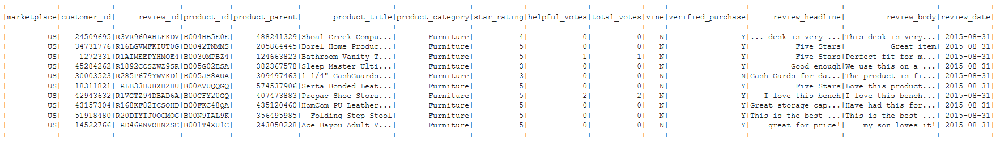

#### Create Four Tables in RDS database using pgAdmin

Listing 5 - PostgreSQL schema (challenge_schema.sql)

```
CREATE TABLE review_id_table (
  review_id TEXT PRIMARY KEY NOT NULL,
  customer_id INTEGER,
  product_id TEXT,
  product_parent INTEGER,
  review_date DATE -- this should be in the formate yyyy-mm-dd
);

-- This table will contain only unique values
CREATE TABLE products_table (
  product_id TEXT PRIMARY KEY NOT NULL UNIQUE,
  product_title TEXT
);

-- Customer table for first data set
CREATE TABLE customers_table (
  customer_id INT PRIMARY KEY NOT NULL UNIQUE,
  customer_count INT
);

-- vine table
CREATE TABLE vine_table (
  review_id TEXT PRIMARY KEY,
  star_rating INTEGER,
  helpful_votes INTEGER,
  total_votes INTEGER,
  vine TEXT,
  verified_purchase TEXT
);
```

#### Create Dataframes in PySpark for each of the 4 Tables in RDS Database

Listing 6 - Create 'customers_df' dataframe from original 'df' dataframe

```
# Create the customers_table DataFrame
# customers_df = df.groupby("").agg({""}).withColumnRenamed("", "customer_count")
from pyspark.sql.functions import count
customers_df = df.groupby("customer_id")\
                .agg({"*": "count"})\
                .withColumnRenamed("count(1)", "customer_count")
customers_df.show(10)
```

Figure 2 - customers_df

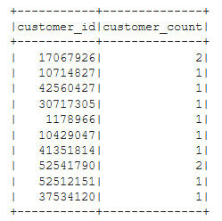

Listing 7 - Create 'products_df' datafrom from original 'df' dataframe

```
# Create the products_table DataFrame and drop duplicates.
products_df = df.select(['product_id', 'product_title']).drop_duplicates()
products_df.show(10)
```

Figure 3 - products_df

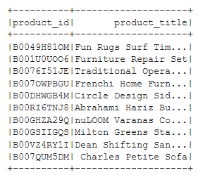

Listing 8 - Create 'review_id_df' dataframe from original 'df' dataframe
```
from pyspark.sql.functions import to_date

# Create the review_id_table DataFrame.
# Convert the 'review_date' column to a date datatype with
# to_date("review_date", 'yyyy-MM-dd').alias("review_date")
review_id_df = df.select(
                  [
                    'review_id',
                    'customer_id',
                    'product_id',
                    'product_parent',
                    to_date("review_date", 'yyyy-MM-dd').alias("review_date")
                  ]
                )
review_id_df.show(10)
```

Figure 4 - review_id_df

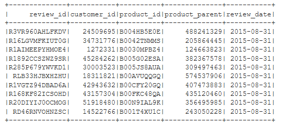

Listing 9 - Create 'vine_df' dataframe from original 'df' dataframe

```
# Create the vine_table. DataFrame
vine_df = df.select(['review_id', 'star_rating', 'helpful_votes', 'total_votes', 'vine', 'verified_purchase'])
vine_df.show(10)
```

Figure 5 - vine_df

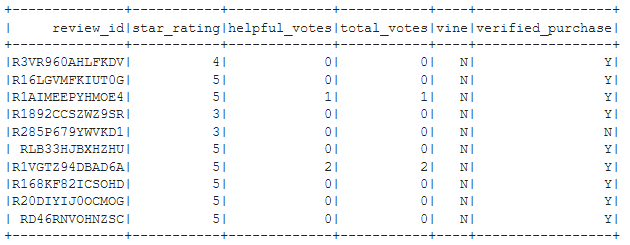

#### Write Dataframes from Google Colab into Amazon RDS Database and Verify

Listing 10 - JDBC setup for database writes

```
# Configure settings for RDS
from getpass import getpass
password = getpass('Enter database password')

mode = "append"

jdbc_url="jdbc:postgresql://dataviz2.cscg8rwqauuq.us-east-2.rds.amazonaws.com:5432/amazon_review3_db"

config = {"user":"postgres",
          "password": password,
          "driver":"org.postgresql.Driver"}
```

Listing 11 - Write 'review_id_df' into RDS

```
# Write review_id_df to table in RDS
# This operation took 2m 10s
review_id_df.write.jdbc(url=jdbc_url, table='review_id_table', mode=mode, properties=config)
```

Listing 12 - Verify 'review_id_table' table in RDS via pgAdmin on local laptop

```
select * from review_id_table limit(5);
```

Figure 6 - First 5 rows of 'review_id_table'

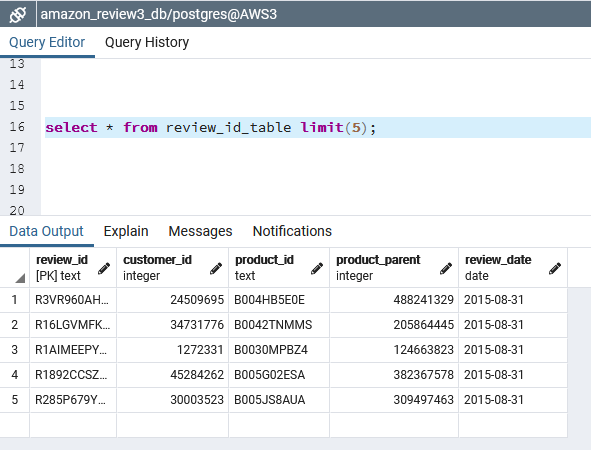

Listing 13 - Write 'products_df' into RDS

```
# Write products_df to table in RDS
# This operation took 1m 15s
products_df.write.jdbc(url=jdbc_url, table='products_table', mode=mode, properties=config)
```

Listing 14 - Verify 'products_table' in RDS via pgAdmin on local laptop

```
select * from products_table limit(5);
```

Figure 7 - First 5 rows of 'products_table'

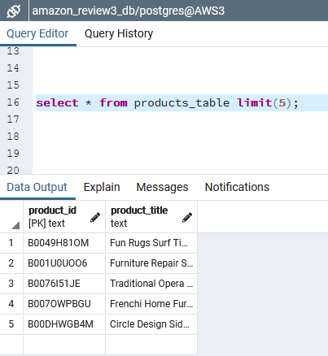

Listing 15 - Write 'customers_df' into RDS

```
# Write customers_df to table in RDS
# Operation took 1m 44s
customers_df.write.jdbc(url=jdbc_url, table='customers_table', mode=mode, properties=config)
```

Listing 16 - Verify 'customers_table' in RDS vis pgAdmin on local laptop

```
select * from customers_table limit(5);
```

Figure 8 - First 5 rows of 'customers_table'

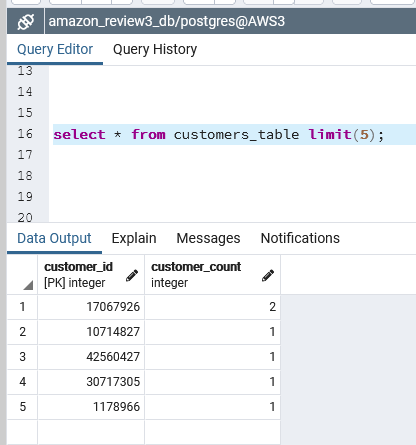

Listing 17 - Write 'vine_df' into RDS

```
# Write vine_df to table in RDS
# Operation took 2m 10s
vine_df.write.jdbc(url=jdbc_url, table='vine_table', mode=mode, properties=config)
```

Listing 18 - Verify 'vine_table' in RDS via pgAdmin on local laptop

```
select * from vine_table limit(5);
```

Figure 9 - First 5 rows of 'vine_table'

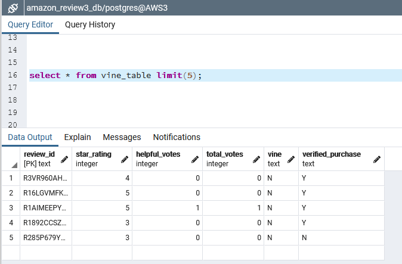

# Deliverable 2

See Listing 1, 2, and 3 above, which are also required for this PySpark Notebook too.

Listing 19 - Create the SQLContext in PySpark

```
from pyspark.sql import SQLContext
sqlContext = SQLContext(spark.sparkContext)
```

Listing 20 - Read 'review_id_table' from RDS to create 'review_id_df' dataframe in PySpark

```
# Read review_id_df from RDS
# Operation took 46s
review_id_df = sqlContext.read.jdbc(url=jdbc_url, table='review_id_table', properties=config)
```

Listing 21 - Read 'products_table' from RDS to create 'products_df' dataframe in PySpark

```
# Read products_df from RDS
# Operation took 9s
products_df = sqlContext.read.jdbc(url=jdbc_url, table='products_table', properties=config)
```

Listing 22 - Read 'customers_table' from RDS to create 'customers_df' dataframe in PySpark

```
# Read customers_df from RDS
# Operation took 11s
customers_df = sqlContext.read.jdbc(url=jdbc_url, table='customers_table', properties=config)
```

Listing 23 - Read 'vine_table' from RDS to create 'vine_df' dataframe in PySpark

```
# Read vine_df from RDS
# Operation took 28s
vine_df = sqlContext.read.jdbc(url=jdbc_url, table='vine_table', properties=config)
```

Listing 24 - Filter 'vine_df' to get reviews with more than 20 total votes

```
tot_votes_gt_20_df = vine_df.filter("total_votes > 20")
tot_votes_gt_20_df.show(10)
```

Figure 10 - First 10 rows of 'tot_votes_gt_20_df' DataFrame

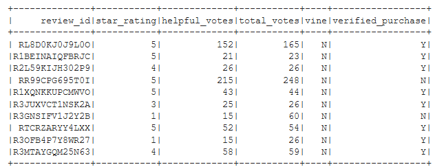

Listing 25 - Filter 'tot_votes_gt_20_df' to get reviews where 'helpful_votes' are more than 50% of 'total_votes'

```
helpful_votes_pct_df = tot_votes_gt_20_df.filter("(helpful_votes / total_votes) > 0.5")
helpful_votes_pct_df.show(10)
```

Figure 11 - First 10 rows of 'helpful_votes_pct_df' DataFrame

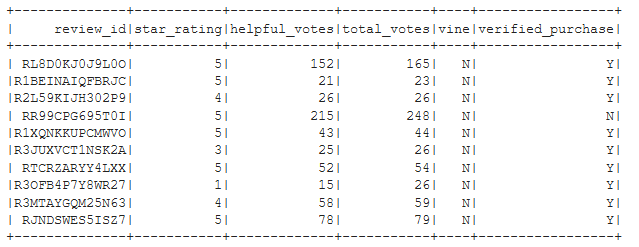]

Listing 26 - Filter 'helpful_votes_pct_df' to get Vine reviews

```
vine_votes_df = helpful_votes_pct_df.filter("vine == 'Y'")
vine_votes_df.show(10)
```

Figure 12 - First 10 rows of 'vine_votes_df'

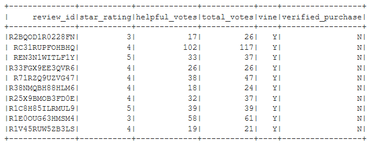

Listing 27 - Same as Listing 26 above, except filter for non-Vine reviews

```
not_vine_votes_df = vine_df.filter("vine == 'N'")
not_vine_votes_df.show(10)
```

Figure 13 - First 10 rows of 'not_vine_votes_df'

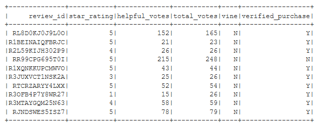

Listing 28 - Calculate metrics to determine Vine review bias

```
n_vines = vine_votes_df.count()
n_other = not_vine_votes_df.count()
n_vine_5stars = vine_votes_df.filter("star_rating == 5").count()
n_other_5stars = not_vine_votes_df.filter("star_rating == 5").count()
pct_vine_5stars = round((n_vine_5stars / n_vines * 100), 2)
pct_other_5stars = round((n_other_5stars / n_other * 100), 2)

print(f"Vines: reviews={n_vines}, 5-star={n_vine_5stars} ({pct_vine_5stars} %)")
print(f"Other: reviews={n_other}, 5-star={n_other_5stars} ({pct_other_5stars} %)")
```

Figure 14 - Small, but evident bias of Vine reviews for 'Furniture' category on Amazon 

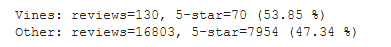
